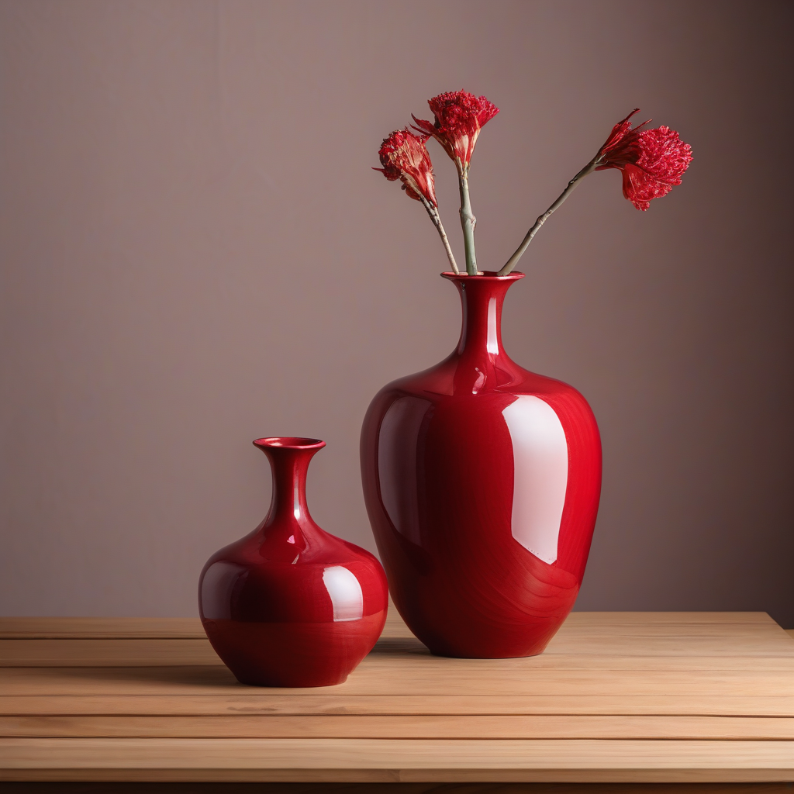

# SDXL 이미지 생성 프로그램

Stable Diffusion XL(SDXL) base 1.0(`stabilityai/stable-diffusion-xl-base-1.0`)을 활용해 텍스트 기반 이미지 생성, 프롬프트 비교, img2img 변환, 소규모 LoRA 적용·학습을 실습하고 프로그램으로 구현하는 프로젝트입니다.

## 실행 환경

- GPU: NVIDIA A100 MIG 20GB
- 기본 생성 해상도: 1024×1024
- 주요 라이브러리: PyTorch, Diffusers, Transformers, Accelerate
- 권장 Python: 3.10 이상

## 프로젝트 범위

- text-to-image 이미지 생성
- seed, steps, guidance scale 비교
- img2img 이미지 변환
- 생성 파라미터와 결과 메타데이터 저장
- 소규모 LoRA 미세조정 및 결과 비교

모델 전체 사전학습과 전체 가중치 미세조정은 이 프로젝트 범위에 포함하지 않습니다.

## 샘플 결과

아래 이미지는 이 프로젝트의 로컬 CLI 및 Gradio 웹앱에서 생성한 샘플이다. 샘플 생성 조건은 함께 저장된 JSON 메타데이터와 실험 문서에서 확인할 수 있다.

### Text-to-Image

모델: SDXL base 1.0 · 해상도: 1024×1024 · seed: 42 · steps: 30 · guidance scale: 7.0



### Seed 비교 샘플

동일 프롬프트와 생성 설정에서 seed를 비교한 결과다.


### Img2Img

원본 이미지에 watercolor 스타일을 적용한 결과다. strength는 0.55다.


## 실행

```bash
python scripts/check_environment.py
python -m app.main generate --prompt "A small traditional Korean tea house in a quiet forest, cinematic photography"
python -m app.ui
```

Gradio UI는 기본적으로 `http://localhost:7860`에서 실행된다. 원격 서버에서는 SSH 포트 포워딩을 사용한다.

## 문서

- [프로젝트 종합계획서](PROJECT_COMPREHENSIVE_PLAN.md)
- [실습·구현 문서 목록](docs/DOCUMENT_INDEX.md)

## GitHub 연동

이 저장소를 GitHub에 연결할 때는 GitHub에서 빈 repository를 만든 뒤 다음 명령을 실행한다. 아래 URL은 실제 GitHub repository 주소로 변경한다.

```bash
git remote add origin https://github.com/<GITHUB_USERNAME>/<REPOSITORY_NAME>.git
git branch -M main
git add .
git commit -m "feat: add SDXL generation application and documentation"
git push -u origin main
```

`.env`, 모델 가중치, 개인 데이터, 대용량 실험 결과는 `.gitignore`로 제외한다.

## 모델 사용 전 확인

모델의 라이선스와 Hugging Face 사용 조건을 확인하고, 학습·입력 데이터의 저작권과 개인정보 처리 여부를 검토해야 합니다.
